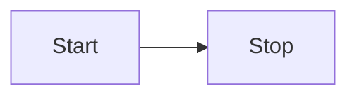

### 1. The "Orchestration" Layer (Automation & Logic)

Your tools: n8n, JavaScript, Python, Claude/Gemini (as planners).

**The Goal:** Move from "running a script" to "building a self-correcting system."

- **Synergy Use Case: "The Autonomous Researcher"**
    
    - **Workflow:** n8n triggers on a new topic 
        
                `→→`
              
        
        n8n calls Perplexity for research 
        
                `→→`
              
        
        n8n sends raw data to Claude to structure it 
        
                `→→`
              
        
        n8n writes a summarized report into Obsidian or Google Sheets.
        
    - **Challenge:** Implement an **"Error-Correction Loop."** If the LLM output fails a JSON schema check in n8n, the workflow should automatically send the error back to the LLM to "fix itself" before proceeding.
        
- **What to learn more:**
    
    - **Advanced n8n:** Error handling (Error Trigger nodes), using the **Code Node** for complex data transformations that standard nodes can't handle.
        
    - **JSON Schema & Pydantic:** Learning how to strictly enforce that an AI must output data in a specific format so your automation doesn't break.
        

### 2. The "Local vs. Cloud" Layer (Privacy & Infrastructure)

Your tools: Ollama, LM Studio, Llama 3, Qwen 2.5 VL, Google AI Studio, Vercel.

**The Goal:** Master the "Decision Matrix"—knowing exactly when to use a cheap/private local model vs. an expensive/smart cloud model.

- **Synergy Use Case: "The Hybrid Intelligence Pipeline"**
    
    - **Workflow:** A user uploads a heavy file. Use a **Local Model (Qwen 3B/Llama 3)** to perform "First Pass" tasks (cleaning text, removing PII, summarizing) to save costs/data. If the task is "High Complexity," the system automatically routes only the cleaned snippet to **Gemini/Claude Pro** for the final reasoning.
        
    - **Challenge:** Benchmark the latency. How much faster is the local model? How much more accurate is the cloud model? Create a "Performance vs. Cost" table.
        
- **What to learn more:**
    
    - **Quantization:** Understanding how GGUF files and 4-bit/8-bit quantization allow you to run big models on smaller hardware (like your Mac).
        
    - **Multimodal Logic:** Mastering how to pass images into Qwen2.5-VL or Llava via API to extract structured data from screenshots.
        

### 3. The "Interface" Layer (UI/UX & Visual Intelligence)

Your tools: Gradio, React, Excalidraw, Mermaid.js, Chart.js.

**The Goal:** Stop making "Chatbots" and start making "Dashboards."

- **Synergy Use Case: "The Generative Whiteboard"**
    
    - **Workflow:** A user types a business process 
        
                `→→`
              
        
        LLM generates Mermaid.js code 
        
                `→→`
              
        
        Gradio renders that code into a live diagram 
        
                `→→`
              
        
        An Excalidraw iframe is injected so the user can manually "tweak" the AI's drawing.
        
    - **Challenge:** Solve the "State Management" problem. How do you make sure the user's manual edits in Excalidraw can be "read" back by the AI?
        
- **What to learn more:**
    
    - **Frontend Injection:** Deep dive into how to inject custom HTML/JavaScript/CSS into Gradio components to create professional-grade UIs.
        
    - **Data Visualization:** Moving beyond simple bars/lines to "Statistical Infographics" (Correlation matrices, Volatility plots) using Matplotlib or Chart.js.
        

### 4. The "Second Brain" Layer (Knowledge & Documentation)

Your tools: Obsidian, GitHub, Claude Code, Antigravity.

**The Goal:** Create a "Living Technical Repository" that grows with your project.

- **Synergy Use Case: "The Automated Dev-Log"**
    
    - **Workflow:** Every time you finish a task in your DPR 
        
                `→→`
              
        
        GitHub commit 
        
                `→→`
              
        
        An n8n workflow detects the commit 
        
                `→→`
              
        
        Summarizes the technical change 
        
                `→→`
              
        
        Automatically updates your Obsidian vault.
        
    - **Challenge:** Use **Claude Code/Antigravity** to refactor your existing monolithic .py files into a modular architecture (agent.py, ui.py, utils.py) automatically.
        
- **What to learn more:**
    
    - **RAG (Retrieval-Augmented Generation):** Learn how to build a local vector database (using ChromaDBor FAISS) so you can "chat with your own Obsidian notes."
        
    - **CI/CD Pipelines:** Mastering the GitHub $\rightarrow$ Vercel automated deployment flow so that every "Save" in your code is a "Live Update" on the web.
        

---

### Summary: The "48-Hour Skill-Up" Plan

|   |   |   |
|---|---|---|
|Day|Focus|Objective|
|**Day 1**|**Automation & Logic**|Build an n8n workflow that includes a **"Self-Correction Loop"** (LLM fixes its own JSON errors).|
|**Day 2**|**UI & Visualization**|Build a Gradio app that converts **Text           `→→`         Mermaid Code           `→→`         Editable Excalidraw Canvas.**|

**If you do these two things, you move from being "Interns using tools" to "AI Engineers building systems."**